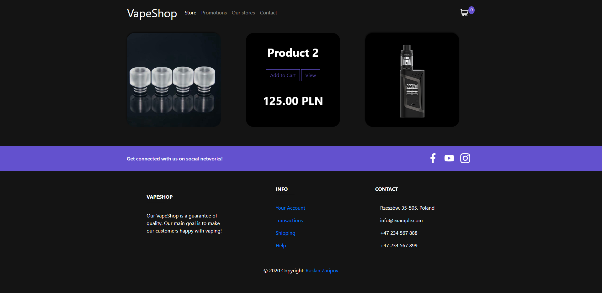
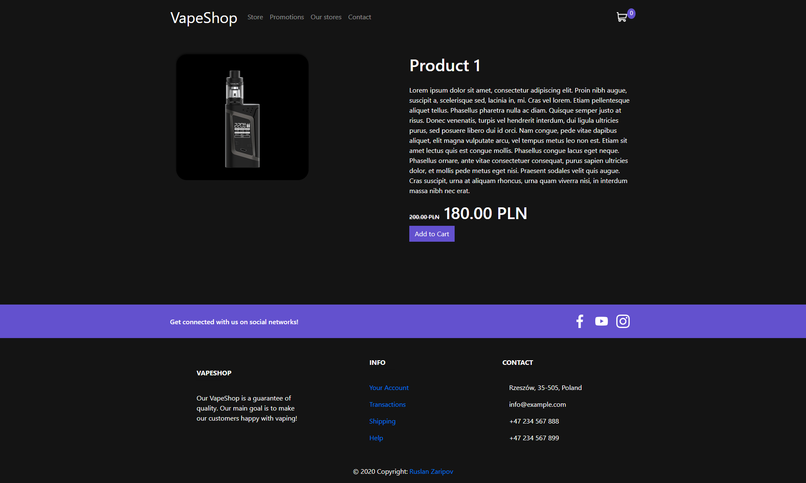
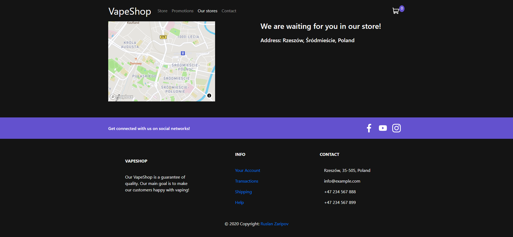
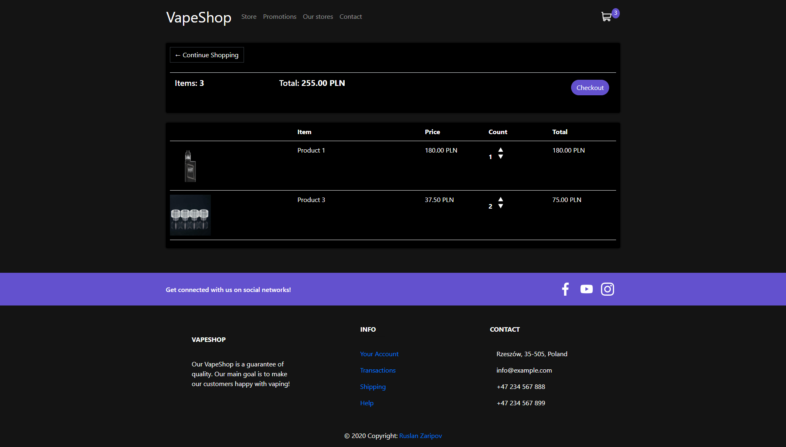
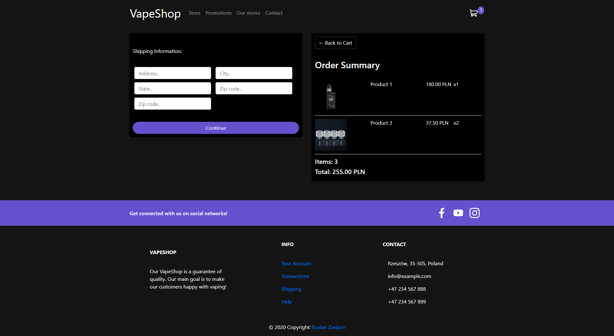

# eCommerce
Simple eCommerce site based on django. For cart system i used javascript AJAX requests.

# Main page
 Main page has list of cards with products images. When hover cursor on card, it is turning around and there you can see title of product, "add to cart" button that adds product to the cart of user by storing it in the cookies for unauthenticated users and storing it in database for authenticated users. There is "view" button that redirects you to the page of product by using id of it, and price as well.
    

# Promotions page
There are products that have some discounts only

# Our stores and Contact pages
Locations and contacts are uploaded from database, so it can be changed from admin panel

# Cart and checkout pages

After adding products, user can change quantity of it at the cart page or remove some items. Checkout page saves shipping info and status of transaction.

 

# Promotions system
Admin can add discount for any product, he has to modify "promotion" parameter in "Product" model. By default this value is 0 that means 0% of discount.
